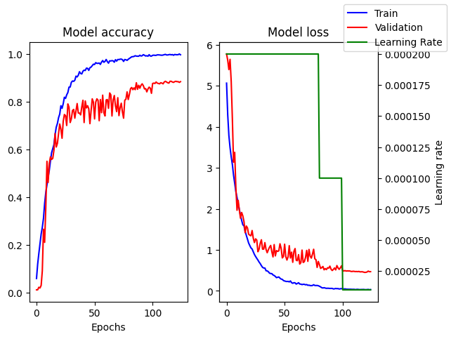

# Face Recognition program (Intro AI)

Group 23 members:

- Nguyen Nhat Minh 20225510
- Doi Sy Thang - 20225528
- Ngo Duy Dat - 20225480
- Ta Ho Thanh Dat - 20225482
- Nguyen Minh Quan - 20225520

## Projects description

A python programme that uses cv2 face detection with a pretrained CNN model for face recognition.
The model is trained using Google Colab T4 GPU and tensorflow libraries on a dataset comprises of
99 different labels, each has about 20 images. The model should be capable to recognise human faces that
it is trained on and be able to put matching label when the uncertainty is low enough.

## CNN model

Our CNN model is inspired by the VGG-16 model and taylored to be able to be trained on a much smaller
dataset. The model accepts 224x224x1 grayscale images as input and the output will the probability
of each image being assigned to each label. The predicted label is considered to be the label
with the highest probability.

The model consists of 8 Convolution layers with ReLu activation followed by BatchNormalization to
perform feature extraction. The last few layers includes a Flatten layer, a Dense layer with ReLu
activation and a Dense layer with Softmax activation for the output. The model also use Adam
optimiser with custom learning rate and SparseCategoricalCrossentropy loss function.
Detail about the model's architecture can be found in .

The dataset is split into two: data_train and data_test and the model is trained exclusively on
data_train. The model is then validate based on its accuracy on data_test and trained with
early escape.

Below is the performance of our model compared with VGG-16:
.

## Requirements

`requirements.txt`

```
cvzone==1.6.1
keras==2.14.0
matplotlib==3.8.0
numpy==1.26.0
opencv-python==4.8.1.78
tensorflow==2.14.0
pyautogui==0.9.54
```

3rd party app: 

## Folder structures

```
.
├── Assets/
|   ├── Faces/              # Image representation of each labels
|   ├── UI/                 # UI assets
├── Models/
|   ├── JSON/               # JSON files containing the information of each model
|   ├── Trained/            # Trained models
|   ├── Weights/            # Model weights
|   ├── summary.txt         # Summary of the main model
|   ├── performance.png     # Comparison between our model and vgg16
|   └── cnn_model.py        # CNN model instance
├── Modules/
|   ├── detect_faces.py     # Face detection module
|   └── get_repr.py         # Handle showing label image
├── face_recognition.py     # Face recognition main program
├── live_recognition.py     # Real time face recognition
├── phone_recognition.py    # Face recognition using better camera from phone and screen capture
└── requirement.txt         # Dependencies

```

## How to use

`face_recognition.py`

- run the python file
- press "f" to flip camera
- press "c" to capture the detected face and give prediction
- press "s" to show captured face
- press "q" to quit
- to swap current model, press "," or "."

  `live_recognition.py`

- run the python file
- press "q" to quit
